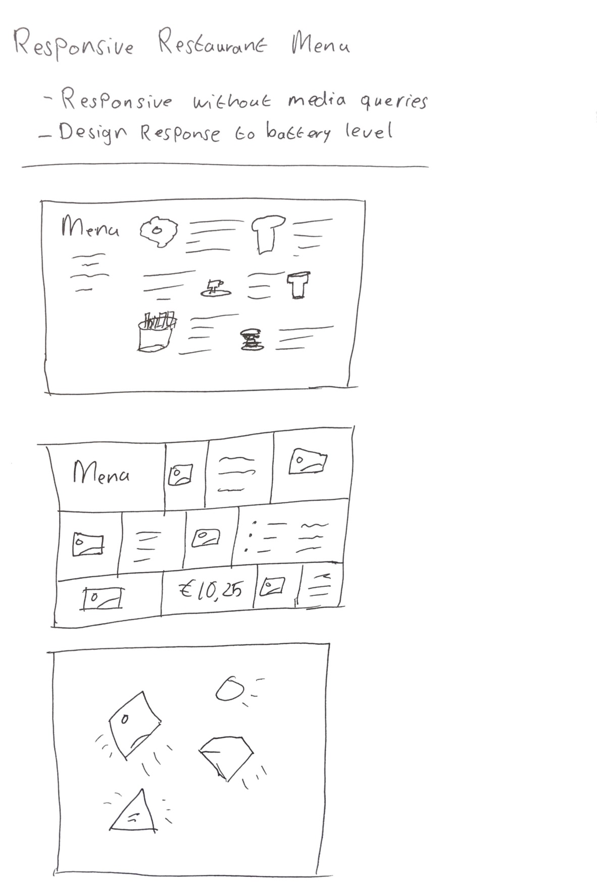

# Responsive Restaurant Menu

### Browser support
The menu card is coded and tested in the latest version of Google Chrome Version: 72. The menu card is not tested in different browsers and may not work properly.

## Sketches

## Digital versions
I my iterations are in a collection on CodePen. Below you will find all the iterations with the link. With each iteration i described a little bit what i tried to do.
[CodePen collection](https://codepen.io/collection/AxzqEW/)

### Version 0.1 (Flexbox - Meals)
[Meals v0.1 - Flexbox](https://codepen.io/tjebbemarchand/pen/rPYPjy)
In this version i made the layout for the meals with CSS Flexbox. I told the teacher that i find it hard to position elements with CSS. As a tip i got the start with styling of individual components, rather throw everything on the page and then start styling.

Next i want to build the same layout, but using CSS Grid rather then Flexbox. I would like to find out what the advantages and disadvantages are with both tools.

### Version 0.2 (Grid - Meals)
[Meals v0.2 - Grid](https://codepen.io/tjebbemarchand/pen/LqrVqb)
I find CSS grid a little bit easier to understand in comparison with CSS Flexbox. One thing i i'm not fully comfortable with are CSS grid areas.

Now i want to build the header of my menu card, see it i can style it the way i sketched it on paper.

### Version 0.1 (Header)
[Header v0.1](https://codepen.io/collection/AxzqEW/)
Another single component i set up was the header part. Here i wanted the title of the menu card and all meals you could get.

### Version 0.3 (Grid - Meals)
[Meals v0.3 - Grid](https://codepen.io/tjebbemarchand/pen/WPyoKK)
In this version i want to check if i could get a different grid patteren for the different meals. I tried different CSS selectors to get the items on the right places. I couldn't figure it out so asked for help of the teacher. Even the teacher had a hard time to figure out what the right selector was for the items. Eventually i just hard code so i could move on with different styling.

### Version 0.1 (App)
[App v0.1](https://codepen.io/tjebbemarchand/pen/aXKybE)
I combined the header and the meals part into 1 app so i can see it as a whole application.

### Version 0.2 (App)
[App v0.2](https://codepen.io/tjebbemarchand/pen/YBOEqG)
I went futher with the app itself and created more room between the items and gave the font a different family so it will fit better together as a whole.

### Version 0.3 (App)
[App v0.3](https://codepen.io/tjebbemarchand/pen/omPopY)
Changed to content for the meals with the right images and text. Gave it overall a different vibe by changing the colors.

### Version 0.4 (App)
[App v0.4](https://codepen.io/tjebbemarchand/pen/RvEJPy)
I tried inserting an SVG i created with Adobe Illustrator. I applied an animation just to try and see what happens. Next i want to change the colours of the SVG and see if i can animate it without the use of ID's and Classes.

### Version 0.5 (App)
[App v0.5](https://codepen.io/tjebbemarchand/pen/gqZKBJ)
I changed to colours of the SVG and added smoke to make it more cool. The smoke is also animated with CSS keyframes animation.

### Version 0.6 (App)
[App v0.6](https://codepen.io/tjebbemarchand/pen/pGqZZa)
In this version i went crazy with the colours. I tried animating automatic colour change on different elements. It gives another vibe to the menu card, i'm not feeling it on the style.

### Version 0.7 (App)
[App v0.7](https://codepen.io/tjebbemarchand/pen/exbaMB)
Changed the colors a bit so it looks better.

### Version 0.8 (App)
[App v0.8](https://codepen.io/tjebbemarchand/pen/mvaZPN)
Added more dynamic interaction in the app. If you hover different objects, they start to move on the page to give more control to the user.

### Version 0.9 (App)
[App v0.9](https://codepen.io/tjebbemarchand/pen/yZGdEp)
I added another SVG to animate in the menu card.

### Version 1.0 (App)
[App v1.0](https://codepen.io/tjebbemarchand/pen/LqoNwx)
Replaced all the image placeholders with animated SVGs. I animated the SVGs all in a different ways. Some are colors changes and others move in different directions.

### Version 1.1 (App)
[App v1.1](https://codepen.io/tjebbemarchand/pen/EMxrKX)
I wanted to create some wind effect, where the main section start to animate to the right to give it the ilusion of wind blowing into it. In this version it starts to animate when you hover the section.

### Version 1.2 (App)
[App v1.2](https://codepen.io/tjebbemarchand/pen/JzjVYY)
I placed a checkbox in the html where user can check it and then the animation starts to play.

### Version 1.3 (App)
[App v1.3](https://codepen.io/tjebbemarchand/pen/EMaxWO)
Tried to add rain to the menu card with CSS. I found it very difficult to animate multipule rain drops. I added a little bit of JavaScript to dynamicly let it rain on the screen. But it is still an CSS animation. 